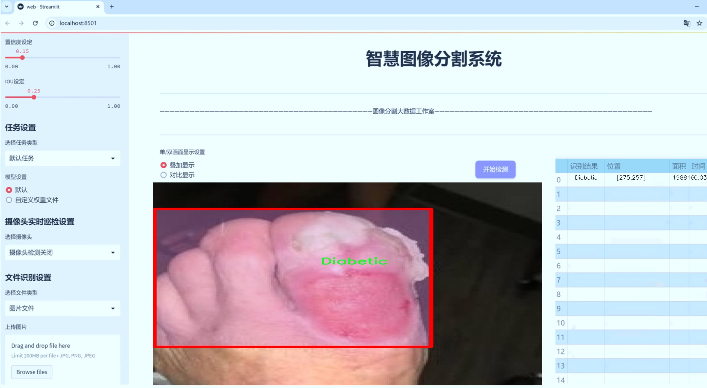
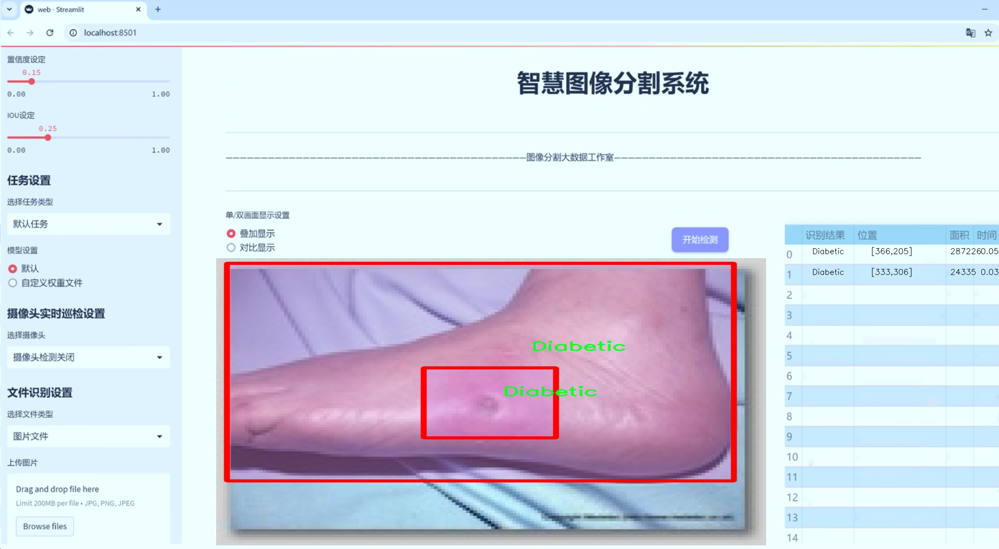
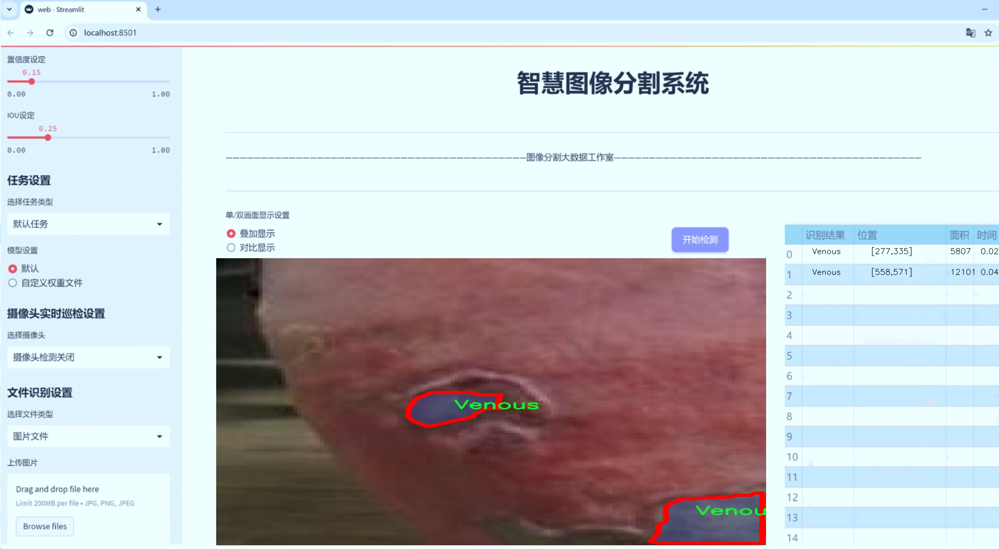
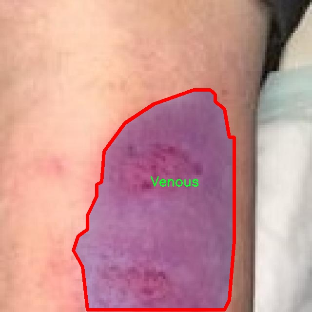
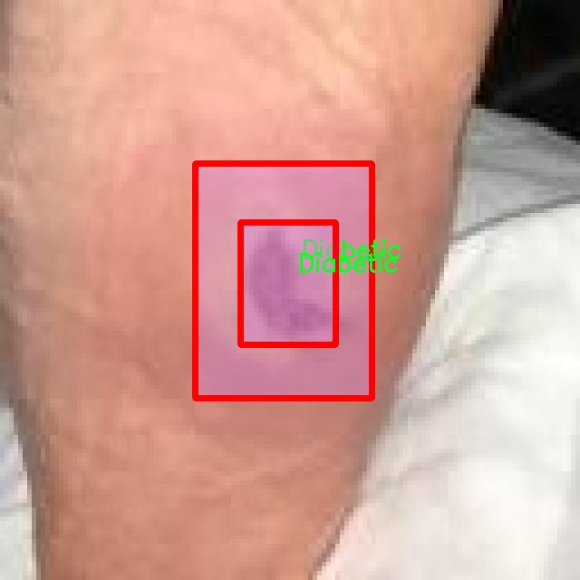
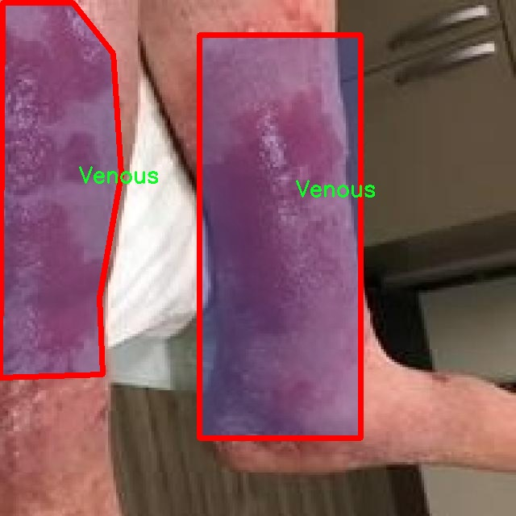
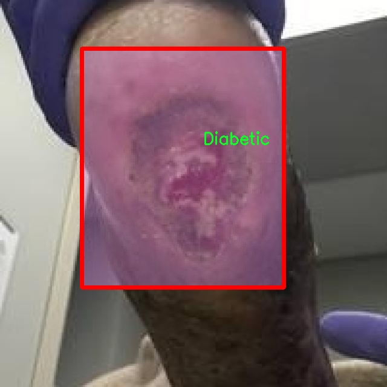
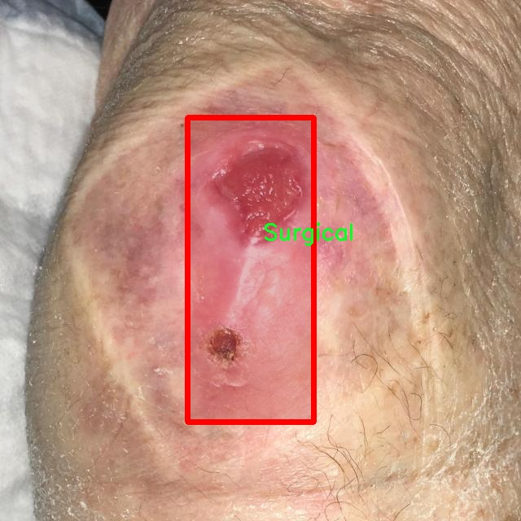

# 伤口类型识别图像分割系统源码＆数据集分享
 [yolov8-seg-rtdetr＆yolov8-seg-GhostHGNetV2等50+全套改进创新点发刊_一键训练教程_Web前端展示]

### 1.研究背景与意义

项目参考[ILSVRC ImageNet Large Scale Visual Recognition Challenge](https://gitee.com/YOLOv8_YOLOv11_Segmentation_Studio/projects)

项目来源[AAAI Global Al lnnovation Contest](https://kdocs.cn/l/cszuIiCKVNis)

研究背景与意义

随着医疗技术的不断进步，伤口护理在临床医学中扮演着越来越重要的角色。伤口的类型多样，包括糖尿病性伤口、压疮、手术后伤口和静脉性伤口等，每种伤口都有其独特的愈合机制和护理需求。准确识别伤口类型对于制定个性化的治疗方案至关重要。然而，传统的伤口识别方法往往依赖于医生的经验和直觉，容易受到主观因素的影响，导致误诊或漏诊。因此，开发一种高效、准确的伤口类型识别系统显得尤为重要。

近年来，深度学习技术的迅猛发展为医学图像处理提供了新的解决方案。YOLO（You Only Look Once）系列模型因其快速和高效的目标检测能力而受到广泛关注。YOLOv8作为该系列的最新版本，具备更强的特征提取能力和更高的检测精度，适合应用于复杂的医学图像分析中。然而，现有的YOLOv8模型在处理伤口类型识别任务时仍存在一定的局限性，尤其是在图像分割精度和多类别识别能力方面。因此，基于改进YOLOv8的伤口类型识别图像分割系统的研究具有重要的学术价值和应用前景。

本研究所使用的数据集包含2000张伤口图像，涵盖糖尿病性伤口、压疮、手术后伤口和静脉性伤口四个类别。这一数据集的构建为模型的训练和验证提供了丰富的样本支持，使得系统能够在多样化的伤口类型中进行有效的学习和识别。通过对这些图像进行实例分割，研究将能够实现对伤口的精确定位和分类，从而为临床医生提供更为直观和可靠的辅助决策依据。

在技术层面，改进YOLOv8的研究将集中于优化网络结构、增强特征提取能力以及提升模型的泛化性能。通过引入先进的图像处理技术和深度学习算法，研究旨在提高伤口类型识别的准确性和效率，进而推动智能医疗的发展。此外，该系统的实现将为伤口护理的标准化和智能化提供重要支持，帮助医务人员更好地进行伤口管理和治疗方案的制定。

总之，基于改进YOLOv8的伤口类型识别图像分割系统的研究，不仅在理论上丰富了医学图像处理领域的研究内容，也在实践中为伤口护理提供了创新的解决方案。通过提升伤口识别的准确性和效率，研究将有助于改善患者的治疗效果，降低医疗成本，推动医疗服务的智能化进程。这一研究的成功实施，将为未来的医学图像分析和智能医疗系统的构建奠定坚实的基础。

### 2.图片演示







##### 注意：由于此博客编辑较早，上面“2.图片演示”和“3.视频演示”展示的系统图片或者视频可能为老版本，新版本在老版本的基础上升级如下：（实际效果以升级的新版本为准）

  （1）适配了YOLOV8的“目标检测”模型和“实例分割”模型，通过加载相应的权重（.pt）文件即可自适应加载模型。

  （2）支持“图片识别”、“视频识别”、“摄像头实时识别”三种识别模式。

  （3）支持“图片识别”、“视频识别”、“摄像头实时识别”三种识别结果保存导出，解决手动导出（容易卡顿出现爆内存）存在的问题，识别完自动保存结果并导出到tempDir中。

  （4）支持Web前端系统中的标题、背景图等自定义修改，后面提供修改教程。

  另外本项目提供训练的数据集和训练教程,暂不提供权重文件（best.pt）,需要您按照教程进行训练后实现图片演示和Web前端界面演示的效果。

### 3.视频演示

[3.1 视频演示](https://www.bilibili.com/video/BV1kqSkYHEGD/)

### 4.数据集信息展示

##### 4.1 本项目数据集详细数据（类别数＆类别名）

nc: 4
names: ['Diabetic', 'Pressure', 'Surgical', 'Venous']


##### 4.2 本项目数据集信息介绍

数据集信息展示

在本研究中，我们使用了名为“Wound Care”的数据集，旨在改进YOLOv8-seg模型在伤口类型识别与图像分割任务中的表现。该数据集专注于四种主要的伤口类型，分别为糖尿病性伤口（Diabetic）、压疮（Pressure）、外科伤口（Surgical）和静脉性伤口（Venous）。通过对这些伤口类型的深入分析与研究，我们期望提升计算机视觉系统在医疗图像处理中的准确性和实用性。

“Wound Care”数据集包含了丰富的图像样本，涵盖了不同患者的伤口情况。这些图像不仅在数量上具有优势，而且在质量上也经过严格筛选，确保每一张图像都能真实反映出伤口的特征。数据集中包含的四个类别各具特点，糖尿病性伤口通常表现为慢性且难以愈合，外科伤口则可能因手术后的恢复过程而呈现出不同的愈合阶段；压疮则多见于长期卧床的患者，常常需要特殊的护理和处理，而静脉性伤口则与血液循环问题密切相关，具有其独特的临床表现。

为了确保模型训练的有效性，数据集中的每个类别都包含了多样化的样本，这些样本在拍摄时考虑了不同的光照条件、拍摄角度和背景环境。这样的设计使得模型在训练过程中能够学习到更为广泛的特征，从而提高其在实际应用中的泛化能力。此外，数据集还包含了相应的标注信息，标注不仅涵盖了伤口的类别，还提供了详细的分割掩码，这对于图像分割任务至关重要。

在数据预处理阶段，我们对图像进行了标准化处理，以确保输入到YOLOv8-seg模型中的数据具有一致的格式和尺寸。这一过程不仅提高了模型的训练效率，还有效减少了因图像差异带来的误差。同时，为了增强模型的鲁棒性，我们还应用了数据增强技术，如随机裁剪、旋转和颜色变换等，这些技术能够进一步丰富训练样本的多样性，使得模型在面对未见过的图像时能够保持较高的识别准确率。

在模型训练过程中，我们将“Wound Care”数据集划分为训练集、验证集和测试集，以便于对模型的性能进行全面评估。训练集用于模型的学习，验证集用于调优超参数，而测试集则用于最终的性能评估。通过这样的划分，我们能够确保模型在未见过的数据上也能表现出良好的识别能力。

总之，“Wound Care”数据集为我们提供了一个丰富而多样的基础，支持我们在伤口类型识别与图像分割领域的研究与应用。通过结合先进的YOLOv8-seg模型，我们期待能够实现更高效的伤口管理与护理，最终为临床实践提供有力的技术支持。











### 5.全套项目环境部署视频教程（零基础手把手教学）

[5.1 环境部署教程链接（零基础手把手教学）](https://www.bilibili.com/video/BV1jG4Ve4E9t/?vd_source=bc9aec86d164b67a7004b996143742dc)


[5.2 安装Python虚拟环境创建和依赖库安装视频教程链接（零基础手把手教学）](https://www.bilibili.com/video/BV1nA4VeYEze/?vd_source=bc9aec86d164b67a7004b996143742dc)

### 6.手把手YOLOV8-seg训练视频教程（零基础小白有手就能学会）

[6.1 手把手YOLOV8-seg训练视频教程（零基础小白有手就能学会）](https://www.bilibili.com/video/BV1cA4VeYETe/?vd_source=bc9aec86d164b67a7004b996143742dc)


按照上面的训练视频教程链接加载项目提供的数据集，运行train.py即可开始训练



     Epoch   gpu_mem       box       obj       cls    labels  img_size
     1/200     0G   0.01576   0.01955  0.007536        22      1280: 100%|██████████| 849/849 [14:42<00:00,  1.04s/it]
               Class     Images     Labels          P          R     mAP@.5 mAP@.5:.95: 100%|██████████| 213/213 [01:14<00:00,  2.87it/s]
                 all       3395      17314      0.994      0.957      0.0957      0.0843

     Epoch   gpu_mem       box       obj       cls    labels  img_size
     2/200     0G   0.01578   0.01923  0.007006        22      1280: 100%|██████████| 849/849 [14:44<00:00,  1.04s/it]
               Class     Images     Labels          P          R     mAP@.5 mAP@.5:.95: 100%|██████████| 213/213 [01:12<00:00,  2.95it/s]
                 all       3395      17314      0.996      0.956      0.0957      0.0845

     Epoch   gpu_mem       box       obj       cls    labels  img_size
     3/200     0G   0.01561    0.0191  0.006895        27      1280: 100%|██████████| 849/849 [10:56<00:00,  1.29it/s]
               Class     Images     Labels          P          R     mAP@.5 mAP@.5:.95: 100%|███████   | 187/213 [00:52<00:00,  4.04it/s]
                 all       3395      17314      0.996      0.957      0.0957      0.0845


### 7.50+种全套YOLOV8-seg创新点代码加载调参视频教程（一键加载写好的改进模型的配置文件）

[7.1 50+种全套YOLOV8-seg创新点代码加载调参视频教程（一键加载写好的改进模型的配置文件）](https://www.bilibili.com/video/BV1Hw4VePEXv/?vd_source=bc9aec86d164b67a7004b996143742dc)

### 8.YOLOV8-seg图像分割算法原理

原始YOLOV8-seg算法原理

YOLOV8-seg算法是YOLO系列中的最新版本，继承了前几代算法的优点，并在此基础上进行了多项创新和改进。该算法不仅关注目标检测，还扩展到目标分割任务，结合了目标检测和语义分割的优势，成为一个高效的实时处理框架。YOLOV8-seg的核心原理在于其独特的网络结构设计和高效的特征提取与融合机制。

YOLOV8-seg的网络结构可以分为三个主要部分：Backbone、Neck和Head。Backbone部分负责特征提取，采用了一系列卷积和反卷积层，通过残差连接和瓶颈结构来提高网络的性能和效率。具体而言，YOLOV8-seg使用了C2模块作为基本构成单元，结合了5个CBS模块、4个C2f模块和1个快速空间金字塔池化(SPPF)模块。C2f模块的引入使得网络在特征提取时能够实现更丰富的梯度流动，提升了模型的表达能力。

在Backbone部分，特征图的生成是通过一系列步长为2的卷积层和C2f模块的组合来实现的。C2f模块的设计允许更多的分支结构，这种结构不仅丰富了特征的多样性，还提高了梯度的回传效率，从而在训练过程中能够更好地优化网络参数。SPPF模块则通过不同内核尺寸的池化操作，进一步增强了特征图的多尺度信息，确保了网络能够有效捕捉到不同尺寸目标的特征。

Neck部分采用了多尺度特征融合技术，通过将来自Backbone不同阶段的特征图进行融合，YOLOV8-seg能够更好地捕捉到不同尺度目标的信息。这一部分使用了双塔结构，结合了特征金字塔网络(FPN)和路径聚合网络(PAN)，有效促进了语义特征和定位特征的转移。通过这种融合机制，YOLOV8-seg在处理复杂场景时，能够显著提高目标检测的性能和鲁棒性。

Head部分则负责最终的目标检测和分割任务。YOLOV8-seg设计了三个检测头，每个检测头都采用了解耦头结构，将分类和定位任务分开处理。这种设计使得模型在进行目标检测时，能够更快地收敛，并提高了分类和定位的精度。解耦头结构的引入，标志着YOLO系列在处理复杂任务时的又一次重要进步，允许模型在同一时间内处理更多的信息。

在数据预处理方面，YOLOV8-seg延续了YOLOv5的策略，采用了马赛克增强、混合增强、空间扰动和颜色扰动等多种增强手段。这些增强手段的引入，旨在提高模型的泛化能力，使其在面对不同的场景和数据时，能够保持较高的检测精度。

YOLOV8-seg在标签分配策略上也进行了创新，采用了动态标签分配策略，避免了传统候选框策略的局限性。通过只使用目标框和目标分数，YOLOV8-seg能够更有效地进行正负样本的匹配。这一策略的实施，使得模型在训练过程中能够更专注于高质量的样本，从而提高了整体的检测性能。

值得一提的是，YOLOV8-seg在损失函数的设计上也进行了优化。其分类损失采用了变焦损失(Varifocal Loss)，回归损失则结合了CIoU Loss和DFL Loss。这种损失函数的设计，旨在通过不对称参数对正负样本进行加权，使得模型在训练时能够更好地聚焦于高质量的正样本，从而提高检测精度。

总的来说，YOLOV8-seg算法通过其创新的网络结构、有效的特征融合机制和灵活的标签分配策略，成功地将目标检测与分割任务结合在一起，展现了出色的性能和应用潜力。无论是在检测精度还是处理速度上，YOLOV8-seg都展现出了显著的优势，成为了计算机视觉领域中的一项重要技术进展。随着YOLOV8-seg的不断发展和优化，未来在自动驾驶、智能监控、医疗影像等领域的应用前景将更加广阔。


### 9.系统功能展示（检测对象为举例，实际内容以本项目数据集为准）

图9.1.系统支持检测结果表格显示

  图9.2.系统支持置信度和IOU阈值手动调节

  图9.3.系统支持自定义加载权重文件best.pt(需要你通过步骤5中训练获得)

  图9.4.系统支持摄像头实时识别

  图9.5.系统支持图片识别

  图9.6.系统支持视频识别

  图9.7.系统支持识别结果文件自动保存

  图9.8.系统支持Excel导出检测结果数据


### 10.50+种全套YOLOV8-seg创新点原理讲解（非科班也可以轻松写刊发刊，V11版本正在科研待更新）

#### 10.1 由于篇幅限制，每个创新点的具体原理讲解就不一一展开，具体见下列网址中的创新点对应子项目的技术原理博客网址【Blog】：


[10.1 50+种全套YOLOV8-seg创新点原理讲解链接](https://gitee.com/qunmasj/good)

#### 10.2 部分改进模块原理讲解(完整的改进原理见上图和技术博客链接)【如果此小节的图加载失败可以通过CSDN或者Github搜索该博客的标题访问原始博客，原始博客图片显示正常】
### YOLOv8简介
Yolov8主要借鉴了Yolov5、Yolov6、YoloX等模型的设计优点，其本身创新点不多，偏重在工程实践上，具体创新如下:
·提供了一个全新的SOTA模型（包括P5 640和P6 1280分辨率的目标检测网络和基于YOLACT的实例分割模型)。并且，基于缩放系数提供了N/S/M/IL/X不同尺度的模型，以满足不同部署平台和应用场景的需求。
●Backbone:同样借鉴了CSP模块思想，不过将Yolov5中的C3模块替换成了C2f模块，实现了进一步轻量化，同时沿用Yolov5中的SPPF模块，并对不同尺度的模型进行精心微调，不再是无脑式—套参数用于所有模型，大幅提升了模型性能。
●Neck:继续使用PAN的思想，但是通过对比YOLOv5与YOLOv8的结构图可以看到，YOLOv8移除了1*1降采样层。
●Head部分相比YOLOv5改动较大，Yolov8换成了目前主流的解耦头结构(Decoupled-Head)，将分类和检测头分离，同时也从Anchor-Based换成了Anchor-Free。
●Loss计算:使用VFLLoss作为分类损失(实际训练中使用BCE Loss);使用DFLLoss+ClOU Loss作为回归损失。
●标签分配: Yolov8抛弃了以往的loU分配或者单边比例的分配方式，而是采用Task-Aligned Assigner正负样本分配策略。
#### Yolov8网络结构
Yolov8模型网络结构图如下图所示。


#### Backbone
Yolov8的Backbone同样借鉴了CSPDarkNet结构网络结构，与Yolov5最大区别是，Yolov8使用C2f模块代替C3模块。具体改进如下:
·第一个卷积层的Kernel size从6×6改为3x3。
·所有的C3模块改为C2f模块，如下图所示，多了更多的跳层连接和额外Split操作。。Block数由C3模块3-6-9-3改为C2f模块的3-6-6-3。

### 上下文引导网络（CGNet）简介


高准确率的模型（蓝点），由图像分类网络转化而来且参数量大，因此大多不适于移动设备。
低分辨率的小模型（红点），遵循分类网络的设计方式，忽略了分割特性，故而效果不好。
#### CGNet的设计：
为了提升准确率，用cgnet探索语义分割的固有属性。对于准确率的提升，因为语义分割是像素级分类和目标定位，所以空间依赖性和上下文信息发挥了重要作用。因此，设计cg模块，用于建模空间依赖性和语义上下文信息。
- 1、cg模块学习局部特征和周围特征形成联合特征
- 2、通过逐通道重新加权（强调有用信息，压缩无用信息），用全局特征改善联合特征
- 3、在全阶段应用cg模块，以便从语义层和空间层捕捉信息。
为了降低参数量：1、深层窄网络，尽可能节约内存 2、用通道卷积


之前的网络根据框架可分三类：
- 1、FCN-shape的模型，遵循分类网络的设计，忽略了上下文信息 ESPNet、ENet、fcn
- 2、FCN-CM模型，在编码阶段后用上下文模块捕捉语义级信息 DPC、DenseASPP、DFN、PSPNet
- 3、（our）在整个阶段捕捉上下文特征
- 4、主流分割网络的下采样为五次，学习了很多关于物体的抽象特征，丢失了很多有鉴别性的空间信息，导致分割边界过于平滑，（our）仅采用三次下采样，利于保存空间信息


#### cg模块

Cg模块：
思路：人类视觉系统依赖上下文信息理解场景。
如图3,a， 如若仅关注黄色框框，很难分辨，也就是说，仅关注局部特征不容易正确识别目标的类别。 然后，如果加入了目标周围的特征，即图3,b，就很容易识别正确，所以周围特征对于语义分割是很有帮助的。在此基础上，如果进一步用整个场景的特征加以辅助，将会有更高的程度去争正确分类黄色框框的物体，如图3,c所示。 故，周围上下文和全局上下文对于提升分割精度都是有帮助的。


实现：基于此，提出cg模块，利用局部特征，周围上下文以及全局上下文。如图3,d所示。该模块共包含两个阶段。

第一步，floc( ) 局部和 fsur( )周围函数分别学习对应特征。floc( )用3x3卷积从周围8个点提取特征，对应于黄色框框；同时fsur( )用感受野更大的3x3带孔卷积学习周围上下文，对应红色框框。然后fjoi( )是指将前两路特征concat之后经BN，PReLU。此一部分是cg模块的第一步。
对于模块的第二步，fglo( )用于提取全局特征，改善联合特征。受SENet启发，全局上下文被认为是一个加权向量，用于逐通道微调联合特征，以强调有用元素、压缩无用元素。在本论文中，fglo( )用GAP产生聚合上下文特征，然后用多层感知机进一步提取全局上下文。最后，使用一个尺度层对联合特征重新加权用提取的全局上下文。
残差连接有利于学习更复杂的特征以及便于训练时梯度反向传播。两个拟设计方案，LRL局部残差连接和GRL全局残差连接，实验证明（消融实验），GRL效果更好

#### CGNet网络


原则：深、瘦（deep and thin）以节省内存。层数少，通道数少，三个下采样。

Stage1，三个标准卷积层，分辨率变成原来的1/2

Stage2和stage3，分别堆叠M和N个cg模块。该两个阶段，第一层的输入是前一阶段第一个和最后一个block的结合（how结合）利于特征重用和特征传播。

将输入图像下采样到1/4和1/8分别输入到第2和3阶段。

最后，用1x1卷积层进行分割预测。

为进一步降低参数量，局部和周围特征提取器采用了逐通道卷积。之前有的工作在逐通道卷积后采用1x1卷积用以改善通道间的信息流动，本文消融实验显示效果不好，分析：因为cg模块中提取的局部和全局特征需要保持通道独立性，所以本论文不使用1*1卷积。


### 11.项目核心源码讲解（再也不用担心看不懂代码逻辑）

#### 11.1 ultralytics\nn\backbone\efficientViT.py

以下是对代码的核心部分进行提炼和详细注释的结果：

```python
import torch
import torch.nn as nn
import torch.nn.functional as F
from timm.models.layers import SqueezeExcite

# 定义一个卷积层和批归一化的组合
class Conv2d_BN(torch.nn.Sequential):
    def __init__(self, in_channels, out_channels, kernel_size=1, stride=1, padding=0, dilation=1, groups=1, bn_weight_init=1):
        super().__init__()
        # 添加卷积层
        self.add_module('conv', torch.nn.Conv2d(in_channels, out_channels, kernel_size, stride, padding, dilation, groups, bias=False))
        # 添加批归一化层
        self.add_module('bn', torch.nn.BatchNorm2d(out_channels))
        # 初始化批归一化的权重
        torch.nn.init.constant_(self.bn.weight, bn_weight_init)
        torch.nn.init.constant_(self.bn.bias, 0)

    @torch.no_grad()
    def switch_to_deploy(self):
        # 将训练模式下的卷积和批归一化层转换为推理模式
        conv, bn = self._modules.values()
        w = bn.weight / (bn.running_var + bn.eps)**0.5
        w = conv.weight * w[:, None, None, None]
        b = bn.bias - bn.running_mean * bn.weight / (bn.running_var + bn.eps)**0.5
        m = torch.nn.Conv2d(w.size(1) * conv.groups, w.size(0), w.shape[2:], stride=conv.stride, padding=conv.padding, dilation=conv.dilation, groups=conv.groups)
        m.weight.data.copy_(w)
        m.bias.data.copy_(b)
        return m

# 定义一个用于合并patch的模块
class PatchMerging(torch.nn.Module):
    def __init__(self, dim, out_dim):
        super().__init__()
        hid_dim = int(dim * 4)  # 隐藏层维度
        self.conv1 = Conv2d_BN(dim, hid_dim, 1)  # 第一个卷积层
        self.act = nn.ReLU()  # 激活函数
        self.conv2 = Conv2d_BN(hid_dim, hid_dim, 3, 2, 1, groups=hid_dim)  # 第二个卷积层
        self.se = SqueezeExcite(hid_dim, .25)  # Squeeze-and-Excitation模块
        self.conv3 = Conv2d_BN(hid_dim, out_dim, 1)  # 输出卷积层

    def forward(self, x):
        # 前向传播
        x = self.conv3(self.se(self.act(self.conv2(self.act(self.conv1(x))))))
        return x

# 定义前馈网络
class FFN(torch.nn.Module):
    def __init__(self, ed, h):
        super().__init__()
        self.pw1 = Conv2d_BN(ed, h)  # 第一个卷积层
        self.act = nn.ReLU()  # 激活函数
        self.pw2 = Conv2d_BN(h, ed, bn_weight_init=0)  # 输出卷积层

    def forward(self, x):
        # 前向传播
        x = self.pw2(self.act(self.pw1(x)))
        return x

# 定义EfficientViT的基本模块
class EfficientViTBlock(torch.nn.Module):
    def __init__(self, type, ed, kd, nh=8, ar=4):
        super().__init__()
        self.dw0 = Conv2d_BN(ed, ed, 3, 1, 1, groups=ed)  # 深度卷积
        self.ffn0 = FFN(ed, int(ed * 2))  # 前馈网络

        if type == 's':
            self.mixer = LocalWindowAttention(ed, kd, nh, attn_ratio=ar)  # 自注意力机制

        self.dw1 = Conv2d_BN(ed, ed, 3, 1, 1, groups=ed)  # 深度卷积
        self.ffn1 = FFN(ed, int(ed * 2))  # 前馈网络

    def forward(self, x):
        # 前向传播
        return self.ffn1(self.dw1(self.mixer(self.ffn0(self.dw0(x)))))


# 定义EfficientViT模型
class EfficientViT(torch.nn.Module):
    def __init__(self, img_size=400, patch_size=16, embed_dim=[64, 128, 192], depth=[1, 2, 3], num_heads=[4, 4, 4]):
        super().__init__()
        self.patch_embed = nn.Sequential(
            Conv2d_BN(3, embed_dim[0] // 8, 3, 2, 1),  # 输入通道为3的卷积层
            nn.ReLU(),
            Conv2d_BN(embed_dim[0] // 8, embed_dim[0] // 4, 3, 2, 1),
            nn.ReLU(),
            Conv2d_BN(embed_dim[0] // 4, embed_dim[0] // 2, 3, 2, 1),
            nn.ReLU(),
            Conv2d_BN(embed_dim[0] // 2, embed_dim[0], 3, 1, 1)
        )

        # 创建多个EfficientViTBlock
        self.blocks = []
        for i in range(len(depth)):
            for _ in range(depth[i]):
                self.blocks.append(EfficientViTBlock('s', embed_dim[i], 16, num_heads[i]))

        self.blocks = nn.Sequential(*self.blocks)  # 将所有块组合成一个序列

    def forward(self, x):
        # 前向传播
        x = self.patch_embed(x)  # 进行patch嵌入
        x = self.blocks(x)  # 通过所有块
        return x

# 创建模型实例
if __name__ == '__main__':
    model = EfficientViT(img_size=224)
    inputs = torch.randn((1, 3, 640, 640))  # 创建输入张量
    res = model(inputs)  # 进行前向传播
    print(res.size())  # 输出结果的尺寸
```

### 代码核心部分分析：
1. **Conv2d_BN**: 这是一个卷积层和批归一化层的组合，提供了训练和推理模式下的权重转换功能。
2. **PatchMerging**: 该模块用于将输入的特征图进行合并，使用了多个卷积层和Squeeze-and-Excitation模块来增强特征表达。
3. **FFN**: 前馈网络模块，包含两个卷积层和一个ReLU激活函数。
4. **EfficientViTBlock**: 这是EfficientViT的基本构建块，包含深度卷积、前馈网络和自注意力机制。
5. **EfficientViT**: 这是整个模型的主类，负责输入的patch嵌入和多个EfficientViTBlock的堆叠。

### 总结：
这个代码实现了一个高效的视觉变换器（EfficientViT），通过模块化的设计使得模型的构建和扩展变得灵活。每个模块都有其特定的功能，组合在一起形成一个强大的图像处理模型。

这个文件实现了一个名为 EfficientViT 的深度学习模型架构，主要用于计算机视觉任务。该模型的设计灵感来源于视觉变换器（Vision Transformer, ViT），并在此基础上进行了优化，以提高效率和性能。

首先，文件中定义了一些必要的库和模块，包括 PyTorch 和一些自定义的层。`Conv2d_BN` 类是一个组合了卷积层和批归一化层的模块，方便在构建网络时使用。该类还包含一个 `switch_to_deploy` 方法，用于在推理阶段将批归一化层转换为卷积层，以提高推理速度。

接下来，`replace_batchnorm` 函数用于替换网络中的批归一化层为恒等映射，以便在推理时减少计算量。

`PatchMerging` 类是 EfficientViT 中的一个重要组件，它通过卷积和激活函数对输入进行处理，并通过 Squeeze-and-Excitation（SE）模块进行通道注意力机制的增强，最后将特征图的分辨率减半。

`Residual` 类实现了残差连接，允许在训练时添加随机噪声以增强模型的鲁棒性。

`FFN` 类实现了前馈神经网络，包含两个卷积层和一个激活函数，主要用于特征的非线性变换。

`CascadedGroupAttention` 和 `LocalWindowAttention` 类实现了不同类型的注意力机制，前者是级联的组注意力，后者是局部窗口注意力。这些注意力机制允许模型在不同的尺度上捕捉特征之间的关系。

`EfficientViTBlock` 类是 EfficientViT 的基本构建块，结合了卷积、前馈网络和注意力机制，形成了一个完整的模块。

`EfficientViT` 类是整个模型的核心，负责构建整个网络结构。它接受多个参数，如输入图像的大小、补丁大小、嵌入维度、深度、头数等。模型的前向传播过程通过多个块进行特征提取，并返回多个输出。

最后，文件定义了一些不同配置的 EfficientViT 模型（如 EfficientViT_m0 到 EfficientViT_m5），每个模型都有不同的超参数设置。提供了函数来创建这些模型，并可以选择加载预训练权重和进行批归一化替换。

在主程序中，创建了一个 EfficientViT_m0 模型实例，并对一个随机生成的输入进行了前向传播，输出了每个阶段的特征图大小。这展示了模型的基本用法和结构。整体来看，这个文件实现了一个高效的视觉变换器模型，适用于各种下游视觉任务。

#### 11.2 ultralytics\utils\ops.py

以下是经过简化和注释的核心代码部分，主要包括了与边界框处理、坐标转换和非极大值抑制（NMS）相关的功能。

```python
import torch
import torchvision

def non_max_suppression(prediction, conf_thres=0.25, iou_thres=0.45, classes=None, max_det=300):
    """
    对一组边界框执行非极大值抑制（NMS），以去除重叠的框。

    Args:
        prediction (torch.Tensor): 预测的边界框，形状为 (batch_size, num_classes + 4, num_boxes)
        conf_thres (float): 置信度阈值，低于该值的框将被过滤。
        iou_thres (float): IoU阈值，低于该值的框在NMS过程中将被过滤。
        classes (List[int]): 需要考虑的类别索引列表。如果为None，则考虑所有类别。
        max_det (int): NMS后保留的最大框数。

    Returns:
        List[torch.Tensor]: 每个图像的保留框的列表，形状为 (num_boxes, 6)，包含 (x1, y1, x2, y2, confidence, class)。
    """
    # 检查置信度和IoU阈值的有效性
    assert 0 <= conf_thres <= 1, f'Invalid Confidence threshold {conf_thres}'
    assert 0 <= iou_thres <= 1, f'Invalid IoU {iou_thres}'

    device = prediction.device
    bs = prediction.shape[0]  # 批量大小
    nc = prediction.shape[1] - 4  # 类别数量
    nm = prediction.shape[1] - nc - 4  # 掩码数量
    xc = prediction[:, 4:4 + nc].amax(1) > conf_thres  # 置信度大于阈值的候选框

    output = [torch.zeros((0, 6 + nm), device=device)] * bs  # 初始化输出
    for xi, x in enumerate(prediction):  # 遍历每个图像的预测
        x = x[xc[xi]]  # 过滤掉低置信度的框
        if not x.shape[0]:  # 如果没有框，继续下一个图像
            continue

        # 分离边界框、置信度和类别
        box, cls, mask = x.split((4, nc, nm), 1)

        # 选择最佳类别
        conf, j = cls.max(1, keepdim=True)
        x = torch.cat((box, conf, j.float(), mask), 1)[conf.view(-1) > conf_thres]

        # 过滤类别
        if classes is not None:
            x = x[(x[:, 5:6] == torch.tensor(classes, device=x.device)).any(1)]

        n = x.shape[0]  # 当前图像的框数量
        if n > max_det:  # 如果框数量超过最大限制，按置信度排序并保留前max_det个框
            x = x[x[:, 4].argsort(descending=True)[:max_det]]

        # 执行NMS
        boxes, scores = x[:, :4], x[:, 4]  # 提取边界框和置信度
        i = torchvision.ops.nms(boxes, scores, iou_thres)  # 进行NMS
        output[xi] = x[i]  # 保存NMS后的框

    return output

def clip_boxes(boxes, shape):
    """
    将边界框裁剪到图像边界内。

    Args:
        boxes (torch.Tensor): 要裁剪的边界框。
        shape (tuple): 图像的形状 (height, width)。
    """
    boxes[..., 0].clamp_(0, shape[1])  # x1
    boxes[..., 1].clamp_(0, shape[0])  # y1
    boxes[..., 2].clamp_(0, shape[1])  # x2
    boxes[..., 3].clamp_(0, shape[0])  # y2

def xyxy2xywh(x):
    """
    将边界框坐标从 (x1, y1, x2, y2) 格式转换为 (x, y, width, height) 格式。

    Args:
        x (torch.Tensor): 输入的边界框坐标。

    Returns:
        y (torch.Tensor): 转换后的边界框坐标。
    """
    y = torch.empty_like(x)  # 创建一个与x形状相同的空张量
    y[..., 0] = (x[..., 0] + x[..., 2]) / 2  # 计算中心x
    y[..., 1] = (x[..., 1] + x[..., 3]) / 2  # 计算中心y
    y[..., 2] = x[..., 2] - x[..., 0]  # 计算宽度
    y[..., 3] = x[..., 3] - x[..., 1]  # 计算高度
    return y

def xywh2xyxy(x):
    """
    将边界框坐标从 (x, y, width, height) 格式转换为 (x1, y1, x2, y2) 格式。

    Args:
        x (torch.Tensor): 输入的边界框坐标。

    Returns:
        y (torch.Tensor): 转换后的边界框坐标。
    """
    y = torch.empty_like(x)  # 创建一个与x形状相同的空张量
    dw = x[..., 2] / 2  # 计算半宽
    dh = x[..., 3] / 2  # 计算半高
    y[..., 0] = x[..., 0] - dw  # 左上角x
    y[..., 1] = x[..., 1] - dh  # 左上角y
    y[..., 2] = x[..., 0] + dw  # 右下角x
    y[..., 3] = x[..., 1] + dh  # 右下角y
    return y
```

### 代码说明：
1. **非极大值抑制（NMS）**：`non_max_suppression` 函数用于从多个预测框中筛选出最优框，避免重叠框的影响。
2. **裁剪框**：`clip_boxes` 函数确保所有边界框都在图像边界内。
3. **坐标转换**：`xyxy2xywh` 和 `xywh2xyxy` 函数用于在不同格式的边界框坐标之间进行转换，以便于后续处理和计算。

这个程序文件是Ultralytics YOLO（You Only Look Once）模型的一部分，主要包含了一些与图像处理、坐标转换、非极大值抑制（NMS）和性能分析相关的工具函数。文件中定义了多个函数和一个类，下面是对其主要内容的逐步讲解。

首先，文件导入了一些必要的库，包括`contextlib`、`math`、`re`、`time`、`cv2`、`numpy`、`torch`和`torchvision`，以及Ultralytics的日志记录器`LOGGER`。

接下来，定义了一个`Profile`类，用于性能分析。这个类可以作为装饰器或上下文管理器使用，记录代码块的执行时间。它的`__enter__`方法在开始计时时被调用，而`__exit__`方法在结束计时时被调用，计算并返回经过的时间。

`segment2box`函数用于将一个分割标签转换为一个边界框标签，并确保框的坐标在图像内部。它接受一个张量作为输入，返回一个包含最小和最大x、y值的数组。

`scale_boxes`函数则用于将边界框从一个图像的尺寸缩放到另一个图像的尺寸。它可以处理图像的填充和比例，并确保边界框的坐标不会超出目标图像的边界。

`make_divisible`函数返回一个最接近的可被指定除数整除的数字，常用于确保网络层的输出维度符合特定要求。

`non_max_suppression`函数实现了非极大值抑制，主要用于去除重叠的边界框，保留置信度最高的框。它支持多标签检测，并允许用户设置置信度阈值、IoU阈值和其他参数。

`clip_boxes`和`clip_coords`函数用于将边界框和坐标限制在图像的边界内，确保它们不会超出图像的尺寸。

`scale_image`函数将掩码调整为原始图像的大小，`xyxy2xywh`和`xywh2xyxy`函数则用于在不同的边界框表示法之间进行转换，例如从左上角和右下角坐标转换为中心坐标和宽高。

`segments2boxes`和`resample_segments`函数用于处理分割结果，将分割区域转换为边界框，并对分割进行重采样。

`crop_mask`函数用于根据给定的边界框裁剪掩码，而`process_mask`和`process_mask_upsample`函数则用于处理掩码，应用于边界框，并可选择性地对掩码进行上采样。

`masks2segments`函数将掩码转换为分割线段，允许用户选择是合并所有分割还是仅选择最大的分割。

最后，`convert_torch2numpy_batch`函数将一个批次的Torch张量转换为NumPy数组，方便后续处理。

总的来说，这个文件提供了一系列实用的工具函数，旨在支持YOLO模型的推理和后处理，尤其是在处理图像、边界框和掩码方面。

#### 11.3 ultralytics\__init__.py

以下是代码中最核心的部分，并附上详细的中文注释：

```python
# Ultralytics YOLO 🚀, AGPL-3.0 license

# 定义当前版本号
__version__ = '8.0.202'

# 从 ultralytics.models 模块导入多个模型类
from ultralytics.models import RTDETR, SAM, YOLO
from ultralytics.models.fastsam import FastSAM
from ultralytics.models.nas import NAS

# 从 ultralytics.utils 模块导入设置、检查和下载工具
from ultralytics.utils import SETTINGS as settings
from ultralytics.utils.checks import check_yolo as checks
from ultralytics.utils.downloads import download

# 定义模块的公开接口，包含版本号和导入的类与函数
__all__ = '__version__', 'YOLO', 'NAS', 'SAM', 'FastSAM', 'RTDETR', 'checks', 'download', 'settings'
```

### 注释说明：
1. **版本号定义**：`__version__` 用于标识当前代码库的版本，方便用户和开发者了解使用的版本。
2. **模型导入**：从 `ultralytics.models` 模块中导入了多种模型（如 YOLO、RTDETR、SAM 等），这些模型通常用于目标检测和图像分割等任务。
3. **工具导入**：
   - `SETTINGS`：包含配置设置的工具。
   - `check_yolo`：用于检查 YOLO 模型的有效性和可用性的工具。
   - `download`：用于下载所需资源的工具。
4. **公开接口定义**：`__all__` 列表定义了当使用 `from module import *` 时，哪些名称是可以被导出的。这有助于控制模块的可见性和使用。

这个程序文件是Ultralytics库的初始化文件，主要用于定义库的版本以及导入相关的模块和功能。首先，文件开头注释部分提到这是Ultralytics YOLO的代码，并标明了其使用的AGPL-3.0许可证，说明该代码是开源的。

接下来，`__version__`变量被定义为'8.0.202'，这表示当前库的版本号。版本号的管理对于软件开发非常重要，它帮助用户和开发者了解所使用的库的具体版本，从而进行相应的维护和更新。

随后，文件导入了多个模型和工具，包括`RTDETR`、`SAM`、`YOLO`、`FastSAM`和`NAS`等。这些模型是Ultralytics库中用于目标检测和图像处理的核心组件。通过这些导入，用户可以直接使用这些模型进行相关的任务。

此外，文件还导入了一些实用工具，如`SETTINGS`、`check_yolo`和`download`。`SETTINGS`可能包含一些配置选项，`check_yolo`用于检查YOLO模型的状态或有效性，而`download`则可能用于下载所需的资源或模型。

最后，`__all__`变量被定义为一个元组，包含了所有希望被导出的名称。这意味着当用户使用`from ultralytics import *`时，只有这些名称会被导入，帮助控制模块的公共接口。

总体来说，这个初始化文件为Ultralytics库的使用提供了基础设置和必要的组件导入，使得用户能够方便地访问和使用库中的功能。

#### 11.4 ultralytics\models\rtdetr\model.py

```python
# Ultralytics YOLO 🚀, AGPL-3.0 license
"""
RT-DETR接口，基于视觉变换器的实时目标检测器。RT-DETR提供实时性能和高准确性，
在CUDA和TensorRT等加速后端表现优异。它具有高效的混合编码器和IoU感知查询选择，
以提高检测准确性。

有关RT-DETR的更多信息，请访问：https://arxiv.org/pdf/2304.08069.pdf
"""

from ultralytics.engine.model import Model  # 导入基础模型类
from ultralytics.nn.tasks import RTDETRDetectionModel  # 导入RT-DETR检测模型

from .predict import RTDETRPredictor  # 导入预测器
from .train import RTDETRTrainer  # 导入训练器
from .val import RTDETRValidator  # 导入验证器


class RTDETR(Model):
    """
    RT-DETR模型接口。该基于视觉变换器的目标检测器提供实时性能和高准确性。
    支持高效的混合编码、IoU感知查询选择和可调的推理速度。

    属性:
        model (str): 预训练模型的路径。默认为'rtdetr-l.pt'。
    """

    def __init__(self, model='rtdetr-l.pt') -> None:
        """
        使用给定的预训练模型文件初始化RT-DETR模型。支持.pt和.yaml格式。

        参数:
            model (str): 预训练模型的路径。默认为'rtdetr-l.pt'。

        异常:
            NotImplementedError: 如果模型文件扩展名不是'pt'、'yaml'或'yml'。
        """
        # 检查模型文件的扩展名是否有效
        if model and model.split('.')[-1] not in ('pt', 'yaml', 'yml'):
            raise NotImplementedError('RT-DETR仅支持从*.pt、*.yaml或*.yml文件创建。')
        # 调用父类构造函数，初始化模型
        super().__init__(model=model, task='detect')

    @property
    def task_map(self) -> dict:
        """
        返回RT-DETR的任务映射，将任务与相应的Ultralytics类关联。

        返回:
            dict: 一个字典，将任务名称映射到RT-DETR模型的Ultralytics任务类。
        """
        return {
            'detect': {
                'predictor': RTDETRPredictor,  # 预测器类
                'validator': RTDETRValidator,  # 验证器类
                'trainer': RTDETRTrainer,      # 训练器类
                'model': RTDETRDetectionModel   # RT-DETR检测模型类
            }
        }
``` 

### 代码核心部分说明：
1. **类定义**：`RTDETR`类继承自`Model`，用于实现RT-DETR目标检测模型的接口。
2. **初始化方法**：`__init__`方法用于初始化模型，检查模型文件的有效性，并调用父类的构造函数。
3. **任务映射**：`task_map`属性返回一个字典，映射了检测任务与相应的预测器、验证器、训练器和模型类。

这个程序文件是Ultralytics库中RT-DETR模型的实现，主要用于实时目标检测。RT-DETR是基于视觉变换器（Vision Transformer）的一种对象检测器，具有实时性能和高准确性，特别适合在CUDA和TensorRT等加速后端上运行。该模型采用了高效的混合编码器和IoU（Intersection over Union）感知的查询选择机制，以提高检测的准确性。

文件中首先导入了必要的模块，包括基础的模型类`Model`、RT-DETR特定的检测模型`RTDETRDetectionModel`，以及用于预测、训练和验证的相关类。

接下来定义了`RTDETR`类，该类继承自`Model`类，作为RT-DETR模型的接口。类的构造函数`__init__`接受一个参数`model`，该参数指定了预训练模型的路径，默认值为'rtdetr-l.pt'。在初始化过程中，程序会检查模型文件的扩展名，确保其为支持的格式（.pt、.yaml或.yml），如果不符合要求，则会抛出`NotImplementedError`异常。

类中还定义了一个属性`task_map`，该属性返回一个字典，映射了与RT-DETR相关的任务和相应的Ultralytics类。这个字典包括预测器、验证器、训练器和检测模型本身，便于在不同的任务中使用RT-DETR模型。

总的来说，这个文件为RT-DETR模型提供了一个清晰的接口，支持用户加载预训练模型并进行目标检测相关的操作。

#### 11.5 ultralytics\nn\backbone\VanillaNet.py

以下是经过简化和注释的核心代码部分：

```python
import torch
import torch.nn as nn
import torch.nn.functional as F
from timm.layers import weight_init

# 定义激活函数类
class Activation(nn.ReLU):
    def __init__(self, dim, act_num=3, deploy=False):
        super(Activation, self).__init__()
        self.deploy = deploy  # 是否处于部署模式
        # 初始化权重参数
        self.weight = torch.nn.Parameter(torch.randn(dim, 1, act_num * 2 + 1, act_num * 2 + 1))
        self.bias = None
        self.bn = nn.BatchNorm2d(dim, eps=1e-6)  # 批归一化
        self.dim = dim
        self.act_num = act_num
        weight_init.trunc_normal_(self.weight, std=.02)  # 权重初始化

    def forward(self, x):
        # 前向传播
        if self.deploy:
            return F.conv2d(
                super(Activation, self).forward(x), 
                self.weight, self.bias, padding=(self.act_num * 2 + 1) // 2, groups=self.dim)
        else:
            return self.bn(F.conv2d(
                super(Activation, self).forward(x),
                self.weight, padding=self.act_num, groups=self.dim))

    def switch_to_deploy(self):
        # 切换到部署模式，融合BN层
        if not self.deploy:
            kernel, bias = self._fuse_bn_tensor(self.weight, self.bn)
            self.weight.data = kernel
            self.bias = torch.nn.Parameter(torch.zeros(self.dim))
            self.bias.data = bias
            self.__delattr__('bn')  # 删除bn属性
            self.deploy = True

    def _fuse_bn_tensor(self, weight, bn):
        # 融合卷积层和BN层的权重
        kernel = weight
        running_mean = bn.running_mean
        running_var = bn.running_var
        gamma = bn.weight
        beta = bn.bias
        eps = bn.eps
        std = (running_var + eps).sqrt()
        t = (gamma / std).reshape(-1, 1, 1, 1)
        return kernel * t, beta + (0 - running_mean) * gamma / std

# 定义基本块
class Block(nn.Module):
    def __init__(self, dim, dim_out, act_num=3, stride=2, deploy=False):
        super().__init__()
        self.deploy = deploy
        # 根据是否部署选择不同的卷积结构
        if self.deploy:
            self.conv = nn.Conv2d(dim, dim_out, kernel_size=1)
        else:
            self.conv1 = nn.Sequential(
                nn.Conv2d(dim, dim, kernel_size=1),
                nn.BatchNorm2d(dim, eps=1e-6),
            )
            self.conv2 = nn.Sequential(
                nn.Conv2d(dim, dim_out, kernel_size=1),
                nn.BatchNorm2d(dim_out, eps=1e-6)
            )
        # 池化层
        self.pool = nn.MaxPool2d(stride) if stride != 1 else nn.Identity()
        self.act = Activation(dim_out, act_num)  # 激活函数

    def forward(self, x):
        # 前向传播
        if self.deploy:
            x = self.conv(x)
        else:
            x = self.conv1(x)
            x = F.leaky_relu(x, negative_slope=1)  # 使用Leaky ReLU激活
            x = self.conv2(x)

        x = self.pool(x)  # 池化
        x = self.act(x)  # 激活
        return x

    def switch_to_deploy(self):
        # 切换到部署模式，融合卷积和BN层
        if not self.deploy:
            kernel, bias = self._fuse_bn_tensor(self.conv1[0], self.conv1[1])
            self.conv = self.conv2[0]
            self.conv.weight.data = kernel
            self.conv.bias.data = bias
            self.__delattr__('conv1')
            self.__delattr__('conv2')
            self.act.switch_to_deploy()
            self.deploy = True

# 定义主网络结构
class VanillaNet(nn.Module):
    def __init__(self, in_chans=3, num_classes=1000, dims=[96, 192, 384, 768], strides=[2, 2, 2, 1], deploy=False):
        super().__init__()
        self.deploy = deploy
        # 网络的初始部分
        if self.deploy:
            self.stem = nn.Sequential(
                nn.Conv2d(in_chans, dims[0], kernel_size=4, stride=4),
                Activation(dims[0])
            )
        else:
            self.stem1 = nn.Sequential(
                nn.Conv2d(in_chans, dims[0], kernel_size=4, stride=4),
                nn.BatchNorm2d(dims[0], eps=1e-6),
            )
            self.stem2 = nn.Sequential(
                nn.Conv2d(dims[0], dims[0], kernel_size=1, stride=1),
                nn.BatchNorm2d(dims[0], eps=1e-6),
                Activation(dims[0])
            )

        self.stages = nn.ModuleList()
        for i in range(len(strides)):
            stage = Block(dim=dims[i], dim_out=dims[i + 1], stride=strides[i], deploy=deploy)
            self.stages.append(stage)

    def forward(self, x):
        # 前向传播
        if self.deploy:
            x = self.stem(x)
        else:
            x = self.stem1(x)
            x = F.leaky_relu(x, negative_slope=1)
            x = self.stem2(x)

        for stage in self.stages:
            x = stage(x)  # 通过每个Block进行前向传播
        return x

    def switch_to_deploy(self):
        # 切换到部署模式
        if not self.deploy:
            self.stem2[2].switch_to_deploy()
            self.deploy = True

# 示例：创建一个VanillaNet模型并进行前向传播
if __name__ == '__main__':
    inputs = torch.randn((1, 3, 640, 640))  # 输入数据
    model = VanillaNet(dims=[128*4, 256*4, 512*4, 1024*4])  # 创建模型
    pred = model(inputs)  # 前向传播
    print(pred.size())  # 输出预测结果的尺寸
```

### 代码说明：
1. **Activation类**：自定义的激活函数类，包含权重和偏置的初始化，以及前向传播的实现。
2. **Block类**：表示网络中的基本块，包含卷积层、批归一化层和激活函数。支持在训练和部署模式之间切换。
3. **VanillaNet类**：主网络结构，包含初始层和多个Block。根据输入通道数和类别数进行初始化，并实现前向传播。
4. **switch_to_deploy方法**：用于将模型从训练模式切换到部署模式，融合批归一化层。
5. **主程序**：创建一个模型实例并进行前向传播，输出结果的尺寸。

这个程序文件定义了一个名为 `VanillaNet` 的神经网络模型，主要用于图像处理任务。该模型的结构和功能相对复杂，包含多个类和函数，下面是对其主要部分的讲解。

首先，文件开头包含版权信息和许可证声明，说明该程序是开源的，并遵循 MIT 许可证。

接下来，程序导入了必要的库，包括 PyTorch 和一些自定义的模块。然后，定义了一个名为 `activation` 的类，继承自 `nn.ReLU`，用于实现一种自定义的激活函数。这个类的构造函数中初始化了权重和偏置，并使用批量归一化（Batch Normalization）来规范化输出。`forward` 方法实现了前向传播，依据是否处于部署模式（deploy）来选择不同的计算方式。

`Block` 类是网络的基本构建模块，包含卷积层、池化层和激活函数。根据是否处于部署模式，`Block` 的构造函数会选择不同的层结构。`forward` 方法中实现了模块的前向传播逻辑，使用了 `activation` 类的实例来处理激活。

`VanillaNet` 类是整个网络的主体，构造函数中定义了网络的输入通道、类别数、层的维度、丢弃率等参数。根据输入的参数，构建了多个 `Block` 实例并将其存储在 `stages` 列表中。网络的前向传播方法 `forward` 处理输入数据并返回特征图。

此外，程序还定义了一些辅助函数，例如 `_init_weights` 用于初始化网络权重，`update_weight` 用于更新模型的权重字典。模型的不同变体（如 `vanillanet_5` 到 `vanillanet_13_x1_5_ada_pool`）通过不同的参数调用 `VanillaNet` 类来创建，支持加载预训练权重。

最后，文件的主程序部分创建了一个输入张量并实例化了 `vanillanet_10` 模型，随后通过模型进行前向传播并打印输出特征图的尺寸。

总体而言，这个文件实现了一个灵活的卷积神经网络架构，支持多种配置和预训练权重的加载，适用于各种图像处理任务。

### 12.系统整体结构（节选）

### 整体功能和构架概括

Ultralytics库是一个用于计算机视觉任务的深度学习框架，特别是目标检测和图像处理。该库实现了多种先进的模型架构，如YOLO、RT-DETR、EfficientViT和VanillaNet，提供了高效的推理和训练功能。库的结构清晰，模块化设计使得用户能够方便地加载预训练模型、进行模型训练和推理。

主要功能包括：
- **模型定义**：实现了多种网络架构，包括卷积神经网络和视觉变换器。
- **工具函数**：提供了图像处理、坐标转换和后处理的实用工具。
- **性能分析**：支持性能监控和分析，帮助用户优化模型。
- **初始化和配置**：提供了库的版本管理和模块导入功能。

### 文件功能整理表

| 文件路径                                       | 功能描述                                                         |
|------------------------------------------------|------------------------------------------------------------------|
| `ultralytics\nn\backbone\efficientViT.py`    | 实现EfficientViT模型架构，包含模型构建、前向传播和预训练权重加载功能。 |
| `ultralytics\utils\ops.py`                     | 提供图像处理、坐标转换、非极大值抑制等工具函数，支持YOLO模型的推理和后处理。 |
| `ultralytics\__init__.py`                      | 定义库的版本信息，导入核心模型和工具，设置公共接口。                     |
| `ultralytics\models\rtdetr\model.py`          | 实现RT-DETR模型，提供加载预训练模型和目标检测功能的接口。                 |
| `ultralytics\nn\backbone\VanillaNet.py`       | 实现VanillaNet模型架构，包含模型构建、前向传播和权重初始化功能。            |

这个表格总结了每个文件的主要功能，帮助用户快速了解Ultralytics库的结构和用途。

注意：由于此博客编辑较早，上面“11.项目核心源码讲解（再也不用担心看不懂代码逻辑）”中部分代码可能会优化升级，仅供参考学习，完整“训练源码”、“Web前端界面”和“50+种创新点源码”以“14.完整训练+Web前端界面+50+种创新点源码、数据集获取”的内容为准。

### 13.图片、视频、摄像头图像分割Demo(去除WebUI)代码

在这个博客小节中，我们将讨论如何在不使用WebUI的情况下，实现图像分割模型的使用。本项目代码已经优化整合，方便用户将分割功能嵌入自己的项目中。
核心功能包括图片、视频、摄像头图像的分割，ROI区域的轮廓提取、类别分类、周长计算、面积计算、圆度计算以及颜色提取等。
这些功能提供了良好的二次开发基础。

### 核心代码解读

以下是主要代码片段，我们会为每一块代码进行详细的批注解释：

```python
import random
import cv2
import numpy as np
from PIL import ImageFont, ImageDraw, Image
from hashlib import md5
from model import Web_Detector
from chinese_name_list import Label_list

# 根据名称生成颜色
def generate_color_based_on_name(name):
    ......

# 计算多边形面积
def calculate_polygon_area(points):
    return cv2.contourArea(points.astype(np.float32))

...
# 绘制中文标签
def draw_with_chinese(image, text, position, font_size=20, color=(255, 0, 0)):
    image_pil = Image.fromarray(cv2.cvtColor(image, cv2.COLOR_BGR2RGB))
    draw = ImageDraw.Draw(image_pil)
    font = ImageFont.truetype("simsun.ttc", font_size, encoding="unic")
    draw.text(position, text, font=font, fill=color)
    return cv2.cvtColor(np.array(image_pil), cv2.COLOR_RGB2BGR)

# 动态调整参数
def adjust_parameter(image_size, base_size=1000):
    max_size = max(image_size)
    return max_size / base_size

# 绘制检测结果
def draw_detections(image, info, alpha=0.2):
    name, bbox, conf, cls_id, mask = info['class_name'], info['bbox'], info['score'], info['class_id'], info['mask']
    adjust_param = adjust_parameter(image.shape[:2])
    spacing = int(20 * adjust_param)

    if mask is None:
        x1, y1, x2, y2 = bbox
        aim_frame_area = (x2 - x1) * (y2 - y1)
        cv2.rectangle(image, (x1, y1), (x2, y2), color=(0, 0, 255), thickness=int(3 * adjust_param))
        image = draw_with_chinese(image, name, (x1, y1 - int(30 * adjust_param)), font_size=int(35 * adjust_param))
        y_offset = int(50 * adjust_param)  # 类别名称上方绘制，其下方留出空间
    else:
        mask_points = np.concatenate(mask)
        aim_frame_area = calculate_polygon_area(mask_points)
        mask_color = generate_color_based_on_name(name)
        try:
            overlay = image.copy()
            cv2.fillPoly(overlay, [mask_points.astype(np.int32)], mask_color)
            image = cv2.addWeighted(overlay, 0.3, image, 0.7, 0)
            cv2.drawContours(image, [mask_points.astype(np.int32)], -1, (0, 0, 255), thickness=int(8 * adjust_param))

            # 计算面积、周长、圆度
            area = cv2.contourArea(mask_points.astype(np.int32))
            perimeter = cv2.arcLength(mask_points.astype(np.int32), True)
            ......

            # 计算色彩
            mask = np.zeros(image.shape[:2], dtype=np.uint8)
            cv2.drawContours(mask, [mask_points.astype(np.int32)], -1, 255, -1)
            color_points = cv2.findNonZero(mask)
            ......

            # 绘制类别名称
            x, y = np.min(mask_points, axis=0).astype(int)
            image = draw_with_chinese(image, name, (x, y - int(30 * adjust_param)), font_size=int(35 * adjust_param))
            y_offset = int(50 * adjust_param)

            # 绘制面积、周长、圆度和色彩值
            metrics = [("Area", area), ("Perimeter", perimeter), ("Circularity", circularity), ("Color", color_str)]
            for idx, (metric_name, metric_value) in enumerate(metrics):
                ......

    return image, aim_frame_area

# 处理每帧图像
def process_frame(model, image):
    pre_img = model.preprocess(image)
    pred = model.predict(pre_img)
    det = pred[0] if det is not None and len(det)
    if det:
        det_info = model.postprocess(pred)
        for info in det_info:
            image, _ = draw_detections(image, info)
    return image

if __name__ == "__main__":
    cls_name = Label_list
    model = Web_Detector()
    model.load_model("./weights/yolov8s-seg.pt")

    # 摄像头实时处理
    cap = cv2.VideoCapture(0)
    while cap.isOpened():
        ret, frame = cap.read()
        if not ret:
            break
        ......

    # 图片处理
    image_path = './icon/OIP.jpg'
    image = cv2.imread(image_path)
    if image is not None:
        processed_image = process_frame(model, image)
        ......

    # 视频处理
    video_path = ''  # 输入视频的路径
    cap = cv2.VideoCapture(video_path)
    while cap.isOpened():
        ret, frame = cap.read()
        ......
```


### 14.完整训练+Web前端界面+50+种创新点源码、数据集获取


# [下载链接：D:\Temporary](D:\Temporary)